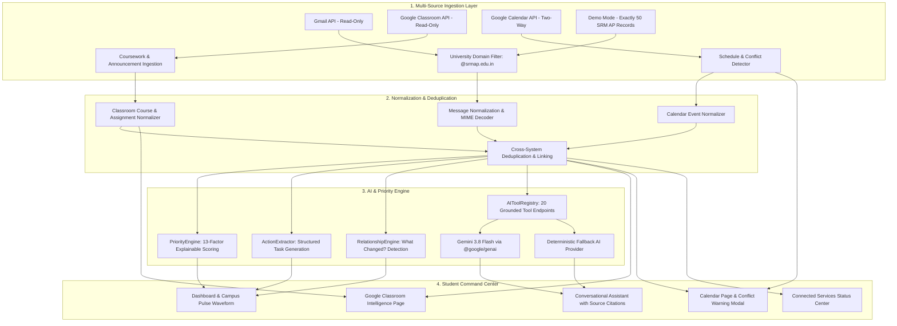

# 🎓 CampusPulse AI — SRM University-AP Edition
### *"Your campus. Prioritized."*

> **Smart India Hackathon / University Innovation Demonstration**  
> **Problem Statement:** PS02 — *"When Systems Don't Understand Each Other"*  
> **Institution:** SRM University-AP, Andhra Pradesh  
> **Campus:** Neerukonda, Mangalagiri Mandal, Guntur District, Andhra Pradesh 522240  
> **Tagline:** *"Your campus. Prioritized."*  

---

## 📌 Problem Statement (PS02): "When Systems Don't Understand Each Other"

In modern universities, essential student information is severely fragmented across disconnected silos:
- **Gmail:** Urgent circulars, exam relocations, rain closure advisories, fee deadlines, club recruitments.
- **Google Classroom:** Assignment postings, quiz announcements, rubrics, and submission tracking.
- **Google Calendar:** Personal lectures, project reviews, and exam slots.
- **Administrative Portals:** Transport schedules, hostel mess advisories, and condonation requirements.

### Why Existing Solutions Fail
1. **Email Overload:** Important notifications get buried among newsletters and routine announcements.
2. **Disconnected Context:** A Google Classroom assignment is announced, an email notification is sent, and an exam is rescheduled in another email—yet no system connects them.
3. **No Explainable Priority:** Students miss deadlines because emails are ranked merely by timestamp.
4. **Hallucination Risk:** Generic AI chat bots invent faculty, room numbers, and dates when answering student questions.

---

## ⚡ The CampusPulse AI Intelligence Layer

CampusPulse AI acts as a **unified student communication intelligence layer**. The student connects their Google account once, and CampusPulse:
1. **Reads relevant university Gmail messages** (Read-Only).
2. **Reads Google Classroom courses, coursework, and announcements** (Read-Only).
3. **Reads Google Calendar events** and identifies conflicts.
4. **Extracts deadlines, actionable tasks, room changes, and schedule shifts**.
5. **Prioritizes what matters to the student** using an explainable 13-factor priority engine.
6. **Cross-links related information across different systems** (e.g. linking Classroom assignment notifications in Gmail directly to the corresponding Classroom coursework).
7. **Answers student questions using 20 grounded retrieval tools** (`searchEmails`, `getUpcomingDeadlines`, `getClassroomAssignments`, `getTodaySchedule`, `checkCalendarConflict`, etc.) with interactive source citations.
8. **Explicit Google Calendar Creation:** Checks for schedule overlaps and duplicates, displays a conflict warning modal, and creates the calendar event *only after explicit student confirmation*.
9. **Provides a pristine Demo Mode** with **EXACTLY 50 high-quality SRM AP communications** covering all realistic scenarios without needing Google credentials.

---

## 🏗️ System Architecture



---

## 🔐 Google OAuth Architecture & Security

CampusPulse AI implements **strict server-side OAuth 2.0**.
- **One Google Login:** A single authorization screen authorizes all required read-only and calendar creation permissions.
- **Server-Side Token Storage:** Refresh tokens and access tokens are held securely in server memory and are **never** returned to the frontend or stored in `localStorage`.
- **Zero Client Secrets in React:** Frontend code only interacts with the backend session API.
- **Read-Only Enforced:** Gmail and Google Classroom APIs are strictly read-only (`gmail.readonly`, `classroom.courses.readonly`, `classroom.coursework.me.readonly`, `classroom.announcements.readonly`). CampusPulse cannot modify, send, or delete student emails or coursework.
- **Explicit Confirmation for Calendar:** CampusPulse **never** silently creates Google Calendar events. Event creation occurs only after conflict/duplicate verification and explicit confirmation.

### Required OAuth Scopes
- `openid`
- `email`
- `profile`
- `https://www.googleapis.com/auth/gmail.readonly`
- `https://www.googleapis.com/auth/classroom.courses.readonly`
- `https://www.googleapis.com/auth/classroom.coursework.me.readonly`
- `https://www.googleapis.com/auth/classroom.announcements.readonly`
- `https://www.googleapis.com/auth/classroom.student-submissions.me.readonly`
- `https://www.googleapis.com/auth/calendar.events`

---

## 🛠️ Technology Stack

| Layer | Technologies Used |
| :--- | :--- |
| **Frontend** | React 19, TypeScript, Vite 8, Tailwind CSS v4, Lucide Icons, Recharts |
| **Backend API** | Node.js v24, Express, TypeScript, `tsx`, `googleapis`, `sanitize-html` |
| **AI Integration** | Google GenAI SDK (`@google/genai`), `gemini-3.8-flash`, Grounded Function Calling & Retrieval |
| **Fallback AI** | Deterministic Regex & Heuristic Rule Engine (100% offline capability) |
| **Security** | Server-side OAuth token store, Strict Domain Filtering (`@srmap.edu.in`), Sanitized HTML rendering |
| **Integrations** | Google Cloud Gmail API, Google Classroom API, Google Calendar API, Google Maps |

---

## ⚙️ Environment Variables

Configure your local `.env` in the project root (never commit secrets to version control):

```env
PORT=3001
NODE_ENV=development
CLIENT_URL=http://localhost:5173

# Application Mode: demo | gmail
APP_MODE=demo

# AI Provider: gemini | mock
AI_PROVIDER=gemini
GEMINI_API_KEY=your_gemini_api_key_here
GEMINI_MODEL=gemini-3.8-flash

# University Domain Filter (Comma-separated)
ALLOWED_UNIVERSITY_DOMAINS=srmap.edu.in

# Google OAuth Credentials
GOOGLE_CLIENT_ID=your_google_client_id_here
GOOGLE_CLIENT_SECRET=your_google_client_secret_here
GOOGLE_REDIRECT_URI=http://localhost:3001/api/google/oauth/callback

# Google Maps API (Optional for enhanced live map rendering)
GOOGLE_MAPS_API_KEY=
```

---

## 🚀 Running the Project Locally

### 1. Install Dependencies
```bash
npm install
npm --prefix server install
npm --prefix client install
```

### 2. Run Tests
CampusPulse AI includes 20 comprehensive unit and integration tests:
```bash
npm test
```

### 3. Build for Production
```bash
npm run build
```

### 4. Start the Application
Run both backend and frontend concurrently:
```bash
npm run dev
```
- **Frontend Command Center:** [http://localhost:5173](http://localhost:5173)
- **Backend API Server:** [http://localhost:3001](http://localhost:3001)

---

---

## 🌟 Unique Features Expansion (Smart India Hackathon PS02)

CampusPulse AI introduces a flagship **Unique Features** suite engineered specifically around the core problem of **"When Systems Don't Understand Each Other"**. All features operate on the **same single source of truth** without synthetic duplication.

| Category | Feature | Route | Description |
| :--- | :--- | :--- | :--- |
| **Understand** | **Campus Knowledge Graph** | `/unique-features/knowledge-graph` | Interactive semantic network connecting Courses, Emails, Classroom assignments, Calendar slots, Actions, and Deadlines with zoom, pan, and filter capabilities. |
| **Understand** | **Information Hub** | `/unique-features/information-hub` | One unified intelligence card per real-world event compressing multiple circulars, reminders, and calendar slots. |
| **Understand** | **Timeline View** | `/unique-features/timeline` | Chronological multi-system progression tracing how an event was announced, updated, rescheduled, and synchronized. |
| **Understand** | **Source Comparison** | `/unique-features/source-comparison` | Side-by-side verification comparing exact field values across Gmail, Classroom, and Calendar without hiding discrepancies. |
| **Detect** | **What Changed Radar** | `/unique-features/changes` | Upgraded detector highlighting BEFORE vs AFTER values for time, date, venue, deadline, and event status with direct Calendar review. |
| **Detect** | **Information Conflict Detector** | `/unique-features/conflicts` | Flagship PS02 contradiction detector comparing timestamps and explicit update circulars to identify cross-system discrepancies. |
| **Detect** | **Truth / Resolution View** | `/unique-features/truth-resolution` | Field-by-field verification status (Confirmed, Supported, Conflicting, Unknown) with strict evidence grounding. |
| **Detect** | **Deadline Risk Detector** | `/unique-features/deadline-risk` | High/Medium/Low risk scoring based on deadline proximity, required actions, submission availability, and reminder velocity. |
| **Detect** | **Communication Health** | `/unique-features/communication-health` | Real-time analytical audit of university communications measuring clarity, deadline rates, venue completeness, and conflicts. |
| **Act** | **AI Calendar Planner** | `/unique-features/calendar-planner` | Interactive day organizer with conflict-checking and duplicate prevention before adding suggested study/event slots. |
| **Act** | **Campus Event Navigator** | `/unique-features/event-navigator` | Physical venue extraction with one-click Google Maps navigation to SRM AP campus buildings and landmarks. |
| **Act** | **"What Happens If I Ignore This?"** | `/actions` (Per-Action) | Evidence-grounded consequence derivation analyzing real circulars to explain the risk of missing a deadline. |
| **Personalize** | **"Why This Matters To Me?"** | `/unique-features/why-it-matters` | Concise, traceable rationale explaining why a specific circular or task is relevant to the student's degree and schedule. |
| **Personalize** | **Opportunity Matcher** | `/unique-features/opportunities` | Discovers hackathons, workshops, research talks, and internships tailored specifically to student context. |
| **Personalize** | **Attention Budget** | `/unique-features/attention-budget` | Prevents cognitive overload by grouping items into Immediate (<24h), This Week, and Informational with a one-click Focus Mode. |
| **Personalize** | **"What Did I Miss?"** | `/unique-features/catch-up` | Time-filtered catch-up digest (Today, Since Yesterday, Last 3 Days, Last Week) summarizing key changes and top actions. |
| **Personalize** | **Smart Notification Digest** | `/unique-features/digest` | Condenses repetitive email threads and reminders into single grouped digest cards. |
| **Personalize** | **Student Command Center** | `/unique-features/command-center` | Consolidated high-density overview bringing together Budget, Risks, Changes, Conflicts, and Today's Schedule. |
| **Demo / Trust** | **Campus Chaos Simulator** | `/unique-features/chaos-simulator` | Live pipeline mutation engine simulating Room Changes, Time Changes, Cancellations, Closures, and Conflicts through the real ingestion and graph pipeline. |
| **Demo / Trust** | **Explain AI Decision** | `/unique-features/explain` | Evidence-based explanation panel showing exact scoring weights and source citations behind every priority score. |
| **Demo / Trust** | **Privacy Center** | `/unique-features/privacy` | Transparent permission inspector showing Read-Only guarantees, server-side token security, and instant Google Account disconnect. |
| **AI** | **Campus AI Briefing** | `/unique-features/briefing` | Structured morning briefing synthesizing today's agenda, next 24 hours, critical changes, and deadline risks. |
| **AI** | **Voice Campus Assistant** | Assistant Drawer | Browser Web Speech API integration (`🎙 Ask CampusPulse`) allowing hands-free queries with graceful fallback. |
| **AI** | **Campus Intelligence Search** | `/unique-features/search` | Global multi-system search querying subjects, senders, assignments, rooms, and dates across all connected systems. |

---

## 🏆 Flagship Hackathon Demonstration Flow (PS02)

To demonstrate why CampusPulse AI is a true cross-system intelligence layer and not just an email summarizer, follow this exact 22-step live demonstration:

1. **Open CampusPulse AI:** Launch the dashboard and note the live Campus Pulse waveform and prioritized notices.
2. **Access Unique Features:** Click **Unique Features** in the sidebar to open the 6-category intelligence landing page (`/unique-features`).
3. **Campus Knowledge Graph:** Open `/unique-features/knowledge-graph`. View how CSE 213 connects Gmail circulars, Classroom assignments, Calendar slots, and synthesized Action items.
4. **Interactive Node Detail:** Click on any node (e.g. Gmail notice or Classroom assignment) to inspect its full metadata and source links.
5. **What Changed Radar:** Navigate to `/unique-features/changes`. Observe the detected logistics shift: **Robotics Workshop venue relocated from Room S202 to Room S204**.
6. **Cross-System Conflict Detector:** Open `/unique-features/conflicts`. Witness the core PS02 challenge:
   - **Source A (Gmail):** 10:00 AM
   - **Source B (Calendar):** 11:00 AM
   - CampusPulse flags the conflict and notes: *"Latest university communication indicates 11:00 AM."*
7. **Source Comparison:** Open `/unique-features/source-comparison` to view side-by-side evidence columns for Gmail, Classroom, and Calendar without hiding discrepancies.
8. **Information Truth Resolution:** Open `/unique-features/truth-resolution` to see the field-by-field verification badges (Confirmed, Supported, Conflicting, Unknown).
9. **Why This Matters:** Open `/unique-features/why-it-matters`. Inspect the student-specific rationale: CSE/AI context, less than 24 hours remaining, participation required.
10. **Deadline Risk Radar:** Navigate to `/unique-features/deadline-risk`. View approaching assignments with HIGH ATTENTION tags and clear reasons why risk was elevated.
11. **Action Consequences:** Go to **Actions** page and click **[ What happens if I ignore this? ]** on any task to see evidence-grounded repercussions extracted from circulars.
12. **AI Calendar Planner:** Open `/unique-features/calendar-planner`. Click **"Organize my day"** to generate an optimized schedule.
13. **Safe Calendar Insertion:** On any suggested schedule item, click **[ Add to Calendar ]**. Notice how the system automatically checks for overlapping calendar slots and prompts for confirmation.
14. **Opportunity Matcher:** Open `/unique-features/opportunities` to see hackathons and workshops matched specifically to the B.Tech CSE AI & ML student profile.
15. **Attention Budget:** Open `/unique-features/attention-budget`. Toggle **Focus Mode** to filter out informational circulars and spotlight only immediate action items.
16. **What Did I Miss?:** Open `/unique-features/catch-up`. Select *"Since Yesterday"* to get an instant 3-bullet summary of critical changes and top actions.
17. **Communication Health:** Open `/unique-features/communication-health` to view real-time statistics calculated on the actual dataset (deadline percentage, venue completeness, duplicate notices).
18. **Campus Event Navigator:** Open `/unique-features/event-navigator` and click **[ Open in Google Maps ]** to route to the exact SRM AP campus building.
19. **Voice Assistant:** Click **Ask CampusPulse** drawer, click the **🎙 Mic button**, and speak *"What do I have tomorrow?"*. Observe the speech-to-text conversion and grounded answer.
20. **Privacy Center:** Open `/unique-features/privacy`. Show the read-only permission matrix, server-side token security, and **[ Disconnect Google ]** capability.
21. **Campus Chaos Simulator:** Navigate to `/unique-features/chaos-simulator`.
22. **Trigger Real-Time Disruption:** Click **[ Simulate Deadline Change ]** or **[ Simulate Room Change ]**. Watch the live pipeline automatically:
    - Ingest the synthetic circular
    - Detect the relationship to the existing event
    - Update What Changed
    - Flag the conflict in the Conflict Detector
    - Recalculate priority scores
    - Update the Knowledge Graph and Dashboard in real time!

---

## 🧪 Testing & Verification

CampusPulse AI features an extensive automated test suite with **35 passing unit and integration tests**:

```bash
npm --prefix server test
```

### Test Coverage Highlights:
- **PriorityEngine (5 tests):** Validates CRITICAL/HIGH/MEDIUM/LOW priority scoring across SRM AP exam venue changes, rain closures, and attendance warnings.
- **UniversityFilter (2 tests):** Confirms `@srmap.edu.in` domain enforcement and noise rejection.
- **ActionExtractor (1 test):** Confirms structured task extraction and deadline parsing.
- **RelationshipEngine (1 test):** Confirms schedule change and postponement detection.
- **FallbackAIProvider (1 test):** Confirms deterministic offline categorization and entity extraction.
- **Demo Dataset (2 tests):** Guarantees EXACTLY 50 university emails covering all required scenarios.
- **Google Calendar Integration (3 tests):** Validates conflict detection, free slots, and duplicate prevention.
- **Google Classroom Integration (1 test):** Confirms active course ingestion, coursework deadlines, and linked emails.
- **AI Tool Retrieval & Grounding (2 tests):** Validates grounded responses with interactive citations.
- **Gmail Normalization (2 tests):** Validates base64 MIME decoding and Classroom notice whitelisting.
- **Unique Features Suite (15 tests):**
  - Knowledge graph node and edge generation
  - Cross-system contradiction detection (Gmail vs Calendar)
  - Information truth resolution with field-level sources
  - Evidence-based "Why This Matters" derivation
  - Deadline risk calculations
  - AI Calendar day planner with conflict safeguards
  - Unified Event synthesis (compressing 3+ notices into 1)
  - Time-filtered "What Did I Miss?" catch-up reports
  - Live communication health metrics on the 50-email dataset
  - CSE/AI opportunity matching
  - Attention budget tiers and Focus Mode filtering
  - Live Chaos Simulator pipeline mutations
  - Action consequence analysis without hallucinations
  - Smart notification digest grouping
  - AIToolRegistry tool catalog completeness

---

## 🔒 Security & Privacy Commitments

- **No Secrets Committed:** API keys and OAuth secrets are strictly configured via environment variables.
- **Server-Side Token Storage:** OAuth access/refresh tokens are maintained in secure server memory and never sent to the browser.
- **Read-Only Scopes:** Gmail and Classroom integrations are strictly read-only.
- **Zero Hallucination Grounding:** If university communication lacks sufficient evidence, the system explicitly reports *"Unknown"* or *"Status Unavailable"*.
- **No Silent Actions:** Calendar events are never written without prior duplicate/conflict checks and explicit user confirmation.

