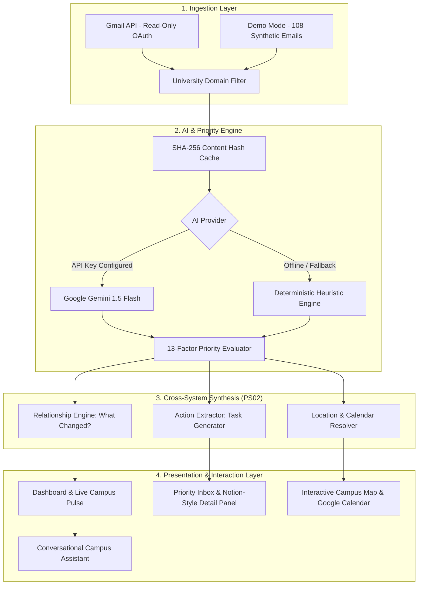

# 🎓 CampusPulse AI
### *"Turn university information overload into clear, prioritized actions."*

> **Smart India Hackathon / University Innovation Demonstration**  
> **Problem Statement:** PS02 — *"When Systems Don't Understand Each Other"*  
> **Tagline:** *"Your campus. Prioritized."*

---

## 📌 Executive Summary & The Problem

University students receive dozens of high-stakes communications daily across fragmented, disconnected departmental portals and departmental email addresses:
- `examinations@university.edu` (Venue relocations, hall tickets, debarment lists)
- `attendance@university.edu` (Attendance shortage notices, condonation deadlines)
- `transport@university.edu` (Bus route delays, breakdown rerouting, gate changes)
- `academics@university.edu` (Coursework schedules, elective allocations, makeup lectures)
- `fees@university.edu` (Tuition fee balance warnings, penalty deadlines)
- `placements@university.edu` (Campus recruitment drives, ATS resume cutoffs)
- `hostel@university.edu` (Curfews, water cutoffs, mess rebates)
- `emergency@university.edu` (Cyclone / severe weather campus closures)

### The Core Dilemma (PS02):
The problem is **not** that information is unavailable.  
The problem is that information is:
1. **Fragmented across departmental silos**
2. **Unstructured and buried in verbose paragraphs**
3. **Difficult to prioritize against competing deadlines**
4. **Lacking contextual awareness between related notices**
5. **Never automatically converted into actionable student tasks**

---

## ⚡ The CampusPulse Transformation

$$\text{DISCONNECTED UNIVERSITY MESSAGES} \longrightarrow \text{AI EXTRACTION} \longrightarrow \text{EXPLAINABLE PRIORITY} \longrightarrow \text{CLEAR ACTIONS}$$

CampusPulse AI coordinates disconnected university communications into:
1. **Live Campus Pulse:** Real-time waveform of incoming university activity.
2. **Explainable 13-Factor Priority Engine:** Transparent scoring (`CRITICAL`, `HIGH`, `MEDIUM`, `LOW`) explaining *why* an email matters.
3. **"What Do I Need To Do?" Task Engine:** Automatically extracts required forms, hall reports, and fee deadlines with 1-click completion.
4. **"What Changed?" & Thread Clustering:** Detects cross-departmental diffs (e.g. Exam hall moved from Block A to Block C; Bus Route 4 delayed by 20 mins to Gate 2).
5. **Campus Map & Google Calendar Integration:** One-click navigation and calendar synchronization.
6. **Gemini Campus Assistant:** Conversational query agent equipped with grounded function tools.

---

## 🏗️ System Architecture



---

## 🛠️ Technology Stack

| Layer | Technologies Used |
| :--- | :--- |
| **Frontend** | React 19, TypeScript, Vite 8, Tailwind CSS v4, Lucide Icons, Recharts, Canvas Confetti |
| **Backend API** | Node.js v24, Express, TypeScript, tsx, CORS |
| **AI Integration** | Google Generative AI (`@google/generative-ai`), Gemini 1.5 Flash, Structured JSON Schema |
| **Fallback AI** | Deterministic Regex & Heuristic Rule Engine (Zero runtime failure guarantee) |
| **Security & Sanitization** | `sanitize-html`, Read-only Gmail Scope, University Domain Whitelisting |
| **Integrations** | Google Cloud Gmail API, Google Maps, Google Calendar (.ics RFC 5545) |

---

## 🎯 Dual Product Modes

### Mode A: Real Gmail Mode
- Connects to Google Workspace / Gmail using OAuth 2.0.
- **Strict Read-Only Scope:** `https://www.googleapis.com/auth/gmail.readonly`.
- **Zero-Modification Privacy Guarantee:** The system **never** composes, modifies, deletes, or forwards emails.
- **Domain Gatekeeper:** Filters inbox to authorized university suffixes (e.g., `@northbridgeuniversity.edu`, `@srmist.edu.in`), rejecting external commercial solicitations and e-commerce receipts.

### Mode B: Demo Mode (Hackathon Showcase)
- Contains **108 controlled, highly realistic synthetic university emails**.
- Preloaded with the 10 core demonstration scenarios:
  1. 🔴 **CRITICAL:** `URGENT: Examination Hall Changed for Tomorrow` (CSE302 moved to Block C Hall 204)
  2. 🟠 **HIGH:** `Attendance Shortage Notice` (68.4% attendance; condonation due Friday 5 PM)
  3. 🟠 **HIGH:** `Bus Route 4 Delayed Tomorrow Morning` (20m delay, Gate 2 drop-off)
  4. 🟡 **MEDIUM:** `Assignment Submission Deadline Extended` (CS304 ML extended to Oct 4)
  5. ⚪ **LOW:** `Photography Club Recruitment & Orientation`
  6. 🟠 **HIGH:** `Fee Payment Deadline Reminder` (Tuition balance due Oct 5)
  7. 🟡 **MEDIUM:** `Technical Symposium Registration Open – InnovateX 2026`
  8. 🔴 **CRITICAL:** `Campus Closed Tomorrow Due to Severe Weather` (Cyclone red alert)
  9. 🟡 **MEDIUM:** `Central Library Timing Updated for Exam Season` (24/7 reading rooms)
  10. ⚪ **LOW:** `Campus Newsletter – October Edition`

---

## ⚖️ The 13-Factor Explainable Priority System

Rather than acting as an opaque black box, CampusPulse calculates a deterministic 0–100 score and explains the exact rationale to the student:

1. **Deadline Proximity:** Deadlines within 24 hours receive maximum urgency weighting.
2. **Immediate Action Required:** Explicit calls for submission (`must report`, `condonation form`).
3. **Direct Student Impact:** Personal notices addressed to the individual student vs broadcast newsletters.
4. **Academic Consequences:** Risk of exam debarment, course failure, or grade freezing.
5. **Financial Consequences:** Late payment surcharges or scholarship cancellation.
6. **Safety Implications:** Severe weather warnings, building evacuations, or curfews.
7. **Transport Disruption:** Route cancellations, shuttle delays, and gate changes.
8. **Examination Impact:** Venue relocations, hall ticket stamping, admit card criteria.
9. **Attendance Shortage:** Cumulative hours falling below the mandatory 75% threshold.
10. **Explicit Urgency Keywords:** `URGENT`, `MANDATORY`, `DEBARMENT`, `IMMEDIATE`, `RED ALERT`.
11. **Student Cohort Size:** Scope of impacted student branches.
12. **Mandatory Action Presence:** Requires student signature, physical report, or upload.
13. **Non-Compliance Penalties:** Disqualification risks if ignored.

---

## 🚀 Getting Started Locally

### Prerequisites
- Node.js **v20+** (Tested on v24.13)
- npm **v10+**

### 1. Clone & Install Dependencies
```bash
git clone <repo-url>
cd "CampusPulse AI"

# Install root, client, and server dependencies in one command
npm run install:all
```

### 2. Configure Environment Variables
Copy the `.env.example` file to `.env`:
```bash
cp .env.example .env
```
Default configuration values work immediately in **Demo Mode** without needing external API keys.

To enable Live Google Gemini:
```env
AI_PROVIDER=gemini
GEMINI_API_KEY=your_actual_gemini_api_key_here
GEMINI_MODEL=gemini-1.5-flash
```

### 3. Run Development Servers
```bash
# Starts both Express backend (Port 3001) and Vite frontend (Port 5173)
npm run dev
```

Open your browser to:
```
http://localhost:5173
```

---

## 🧪 Running Automated Tests

The application includes automated unit and integration tests covering priority calculation, domain filtering, action extraction, and deterministic AI parsing:

```bash
npm test
```

Test output:
```
▶ PriorityEngine Tests
  ✔ evaluates urgent exam venue change as CRITICAL
  ✔ evaluates attendance shortage warning as HIGH priority
  ✔ evaluates monthly general newsletter as LOW priority
▶ UniversityFilter Tests
  ✔ allows institutional university domains
  ✔ rejects external commercial and promotional noise
▶ ActionExtractor Tests
  ✔ extracts actionable tasks with deadlines
▶ FallbackAIProvider Tests
  ✔ extracts structured analysis deterministically
ℹ tests 7 | pass 7 | fail 0
```

---

## ☁️ Google Cloud & OAuth Setup Guide

If you wish to configure live **Gmail Mode** or **Google Maps**:

### 1. Google Cloud Console Setup
1. Go to the [Google Cloud Console](https://console.cloud.google.com/).
2. Create a new project named `CampusPulse-AI`.
3. Navigate to **APIs & Services > Library**.
4. Enable the following APIs:
   - **Gmail API**
   - **Google Maps JavaScript API** (Optional)
   - **Google Calendar API** (Optional)

### 2. OAuth Consent Screen
1. Go to **APIs & Services > OAuth consent screen**.
2. Select **External** user type.
3. App name: `CampusPulse AI`.
4. User support email: `your-email@gmail.com`.
5. Under **Scopes**, add:
   - `https://www.googleapis.com/auth/gmail.readonly`
6. Under **Test Users**, add your university email address.

### 3. Create OAuth Credentials
1. Go to **APIs & Services > Credentials > Create Credentials > OAuth client ID**.
2. Application type: **Web application**.
3. Name: `CampusPulse Web Client`.
4. Authorized redirect URIs:
   ```
   http://localhost:3001/api/gmail/oauth/callback
   ```
5. Copy your **Client ID** and **Client Secret** into your `.env` file:
   ```env
   GOOGLE_CLIENT_ID=your_client_id.apps.googleusercontent.com
   GOOGLE_CLIENT_SECRET=your_client_secret
   ```

---

## 🎬 60-Second Hackathon Demo Script

When presenting to judges for **PS02 ("When Systems Don't Understand Each Other")**:

1. **Open the Dashboard (`http://localhost:5173`):**
   - Point to the **Campus Pulse Visualizer**: *"Out of 108 fragmented emails sent by 12 departments, only 3 require urgent student attention today."*
2. **Review the AI Campus Briefing:**
   - Read the synthesis: *"1 critical alert (Exam venue shifted) and 2 high-priority items."*
3. **Click the Critical Card ("URGENT: Examination Hall Changed for Tomorrow"):**
   - Show the Notion-style detail view.
   - Highlight **Why This Is Ranked CRITICAL** (Exam starts at 9:00 AM; venue moved from Block A to Block C Hall 204).
   - Click **"Open in Google Maps"** to show instant venue navigation.
4. **Open "What Changed?" in the Sidebar:**
   - Show how CampusPulse solved PS02: It connected 3 isolated emails (exam schedule notice, hall ticket rules, and emergency relocation) and produced a visual before/after diff.
5. **Simulate a Live Incoming Email:**
   - Click **"Simulate Email"** in the top header.
   - Watch the animated pulse bar expand, the real-time notification toast slide in, and a new urgent task appear in **My Actions**.
6. **Ask the AI Campus Assistant:**
   - Click **"Ask AI"** and select *"What do I need to do today?"*.
   - The assistant invokes `getUrgentMessages()` and delivers a grounded checklist referencing the exact notices.

---

## 🔒 Security & Privacy

- **Safe HTML Sanitization:** All email bodies pass through `sanitize-html` to prevent stored XSS attacks.
- **No Token Leakage:** OAuth refresh tokens and Gemini API keys are kept strictly in backend memory and `.env`.
- **Zero Modification:** The application cannot send, modify, or delete student emails.
- **SHA-256 Privacy Cache:** Email hashes prevent unnecessary external AI calls.

---

## 📄 License
MIT License. Built for Smart India Hackathon & University Academic Excellence.
