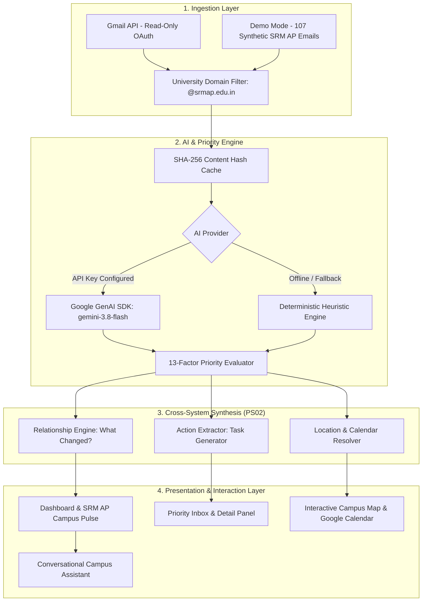

# 🎓 CampusPulse AI — SRM University-AP Edition
### *"Your campus. Prioritized."*

> **Smart India Hackathon / University Innovation Demonstration**  
> **Problem Statement:** PS02 — *"When Systems Don't Understand Each Other"*  
> **Institution:** SRM University-AP, Andhra Pradesh  
> **Campus:** Neerukonda, Mangalagiri Mandal, Guntur District, Andhra Pradesh 522240  
> **Tagline:** *"Your campus. Prioritized."*  

---

## 📌 Executive Summary & The Problem

University students receive dozens of high-stakes communications daily across fragmented, disconnected departmental portals and departmental email addresses:
- `communications@srmap.edu.in` (Directorate of Communications — Institutional workshops, symposia, Techfest IIT Bombay events)
- `registrar.office@srmap.edu.in` (Registrar Office — Heavy rain university closures, compensatory working days, administrative circulars)
- `dean.seas@srmap.edu.in` (Dean, School of Engineering and Sciences — Academic alerts, debarment criteria)
- `hod.cse@srmap.edu.in` (HOD Computer Science & Engineering — Mid-term exam venue shifts, lab reallocations)
- `ecell@srmap.edu.in` (Directorate of Entrepreneurship & Innovation — STARTUP WARS postponements, incubator pitches)
- `cel@srmap.edu.in` (Center for Entrepreneurial Learning — Mentor review schedules, slide deck cutoffs)
- `acm.core@srmap.edu.in` (ACM Student Chapter — R&D, Events, PR, Social Media team recruitments)
- `students.seas@srmap.edu.in` (SEAS Student Notices — Attendance warnings, fee installment reminders)

### The Core Dilemma (PS02):
The problem is **not** that university information is unavailable.  
The problem is that information is:
1. **Fragmented across departmental silos**
2. **Unstructured and buried in verbose circulars**
3. **Difficult to prioritize against competing deadlines**
4. **Lacking contextual awareness between related notices**
5. **Never automatically converted into actionable student tasks**

---

## ⚡ The CampusPulse Transformation

$$\text{DISCONNECTED UNIVERSITY SYSTEMS} \longrightarrow \text{CONNECTED STUDENT CONTEXT}$$

$$\text{EMAIL} \longrightarrow \text{TIMETABLE} \longrightarrow \text{LOCATION} \longrightarrow \text{DEADLINE} \longrightarrow \text{STUDENT ACTION}$$

CampusPulse AI coordinates disconnected SRM University-AP communications into:
1. **SRM AP Campus Pulse:** Real-time visual waveform of incoming university activity.
2. **Explainable 13-Factor Priority Engine:** Transparent scoring (`CRITICAL`, `HIGH`, `MEDIUM`, `LOW`) explaining *why* a notice matters.
3. **Connected Campus Information (PS02):** Connects Email (Venue shift), Timetable (CSE 204 exam slot), Location (S202, SR Block), and Deadline into a single unified student action.
4. **"What Changed?" & Thread Clustering:** Detects cross-departmental diffs (e.g. Sept 25 heavy rain closure with Oct 10 compensatory working day; STARTUP WARS postponement; CSE 204 venue move to S202 SR Block; Bus Route 5 & 8 delay).
5. **Campus Map & Google Calendar Integration:** Verified coordinates for S202 SR Block, X-Lab Auditorium, Room 114 Admin Block, and Bus Bay 2.
6. **Gemini Campus Assistant:** Conversational query agent equipped with grounded SRM AP campus context using Google's newest `@google/genai` SDK (`gemini-3.8-flash`).

---

## 🏗️ System Architecture



---

## 🛠️ Technology Stack

| Layer | Technologies Used |
| :--- | :--- |
| **Frontend** | React 19, TypeScript, Vite 8, Tailwind CSS v4, Lucide Icons, Recharts, Canvas Confetti |
| **Backend API** | Node.js v24, Express, TypeScript, tsx, CORS |
| **AI Integration** | Google GenAI SDK (`@google/genai`), `gemini-3.8-flash`, Structured JSON Schema |
| **Fallback AI** | Deterministic Regex & Heuristic Rule Engine (100% offline capability) |
| **Security & Sanitization** | `sanitize-html`, Read-only Gmail Scope, University Domain Whitelisting (`@srmap.edu.in`) |
| **Integrations** | Google Cloud Gmail API, Google Maps, Google Calendar (.ics RFC 5545) |

---

## 🎯 Dual Product Modes

### Mode A: Real Gmail Mode
- Connects to Google Workspace / Gmail using OAuth 2.0.
- **Strict Read-Only Scope:** `https://www.googleapis.com/auth/gmail.readonly`.
- **Zero-Modification Privacy Guarantee:** The system **never** composes, modifies, deletes, or forwards emails.
- **Domain Gatekeeper:** Filters inbox to authorized university suffixes (`@srmap.edu.in`, `@srmist.edu.in`), rejecting external commercial solicitations and e-commerce receipts.

### Mode B: SRM AP Demo Mode (Hackathon Showcase)
- Contains **107 controlled, highly realistic synthetic university communications**.
- Preloaded with authentic SRM University-AP demonstration scenarios:
  1. 🔴 **CRITICAL:** `URGENT: Examination Venue Changed for Tomorrow` (CSE 204 moved to S202, SR Block)
  2. 🔴 **CRITICAL:** `CIRCULAR: University Closure on September 25 due to Heavy Rainfall` (Compensatory day Oct 10)
  3. 🟠 **HIGH:** `Attendance Shortage Notice – CSE 204 & CSE 207` (Medical condonation due Friday 5 PM at Room 114)
  4. 🟠 **HIGH:** `Transport Alert: Route 5 & 8 Delayed via Mangalagiri Bypass` (Main Gate Bay 2 arrival)
  5. 🟡 **MEDIUM:** `ACM Student Chapter Recruitment 2026 — Applications Open` (Deadline Sept 30)
  6. 🟠 **HIGH:** `STARTUP WARS 2026 Postponed` (E-Cell schedule update)
  7. 🟠 **HIGH:** `CEL Presentation Submission & Mentor Review Schedule` (Rakesh Sir & Thirumali Sir teams)
  8. 🟡 **MEDIUM:** `Techfest IIT Bombay & SRM AP Joint Robotics Workshop` (S202 SR Block)
  9. 🟡 **MEDIUM:** `Google Solution Hunt Challenge 2026 — GDG on Campus` (X-Lab Auditorium)
  10. 🟠 **HIGH:** `Odd Semester Tuition Fee Installment Deadline` (No fine cutoff Oct 5)

---

## ⚖️ The 13-Factor Explainable Priority System

Rather than acting as an opaque black box, CampusPulse calculates a deterministic 0–100 score and explains the exact rationale to the student:

1. **Deadline Proximity:** Deadlines within 24 hours receive maximum urgency weighting.
2. **Immediate Action Required:** Explicit calls for submission (`must report`, `condonation form`).
3. **Direct Student Impact:** Personal notices addressed to the individual student vs broadcast newsletters.
4. **Academic Consequences:** Risk of exam debarment, course failure, or grade freezing.
5. **Financial Consequences:** Late payment surcharges or scholarship cancellation.
6. **Safety Implications:** Heavy rainfall closures, weather advisories, or road waterlogging.
7. **Transport Disruption:** Route cancellations, shuttle delays, and gate changes.
8. **Examination Impact:** Venue relocations, hall ticket stamping, admit card criteria.
9. **Attendance Shortage:** Cumulative hours falling below the mandatory 75% threshold.
10. **Explicit Urgency Keywords:** `URGENT`, `MANDATORY`, `DEBARMENT`, `IMMEDIATE`, `CLOSURE`.
11. **Student Cohort Size:** Scope of impacted student branches (e.g. SEAS B.Tech CSE).
12. **Mandatory Action Presence:** Requires student signature, physical report, or upload.
13. **Non-Compliance Penalties:** Disqualification risks if ignored.

---

## 🚀 Getting Started Locally

### Prerequisites
- Node.js **v20+** (Tested on v24.13)
- npm **v10+**

### 1. Clone & Install Dependencies
```bash
git clone <repo-url>
cd "CampusPulse AI"

# Install root, client, and server dependencies in one command
npm run install:all
```

### 2. Configure Environment Variables
Copy `.env.example` to `.env`:
```bash
cp .env.example .env
```

To enable Live Google Gemini:
```env
AI_PROVIDER=gemini
GEMINI_API_KEY=your_actual_gemini_api_key_here
GEMINI_MODEL=gemini-3.8-flash
ALLOWED_UNIVERSITY_DOMAINS=srmap.edu.in
```

### 3. Run Development Servers
```bash
# Starts both Express backend (Port 3001) and Vite frontend (Port 5173)
npm run dev
```

Open your browser to:
```
http://localhost:5173
```

---

## 🧪 Running Automated Tests

```bash
npm test
```

Test output:
```
▶ PriorityEngine Tests — SRM AP Scenarios
  ✔ evaluates urgent exam venue change to S202 SR Block as CRITICAL
  ✔ evaluates university rain closure circular as CRITICAL
  ✔ evaluates attendance shortage warning as HIGH priority
  ✔ evaluates ACM recruitment deadline as MEDIUM priority with actionable deadline
  ✔ evaluates monthly general newsletter as LOW priority
▶ UniversityFilter Tests — SRM AP Domain Security Policy
  ✔ allows official SRM AP institutional email addresses
  ✔ rejects external commercial and promotional noise
▶ ActionExtractor Tests
  ✔ extracts actionable tasks with deadlines for SRM AP student
▶ RelationshipEngine — "What Changed?" Tests
  ✔ detects schedule changes and postponements in university communications
▶ FallbackAIProvider Tests — SRM AP Category Mapping
  ✔ extracts structured analysis deterministically for SRM AP notices
ℹ tests 10 | pass 10 | fail 0
```

---

## 🎬 Hackathon Presentation Scenario (PS02)

1. **Dashboard & SRM AP Campus Pulse:**
   - Visualizes 107 university communications analyzed across 12 departments.
   - Shows **Connected Campus Information**: Email $\rightarrow$ Timetable $\rightarrow$ Location $\rightarrow$ Action.
2. **Open Critical Notice ("Exam Venue Relocation"):**
   - AI summary highlights venue moved from Central Hall to Room S202, SR Block.
   - Click **"Open in Google Maps"** for instant navigation to SR Block, Neerukonda.
3. **Inspect "What Changed?":**
   - Highlights the heavy rain closure on Sept 25 and compensatory working day on Oct 10.
   - Displays: **WHAT CHANGED?**, **WHY IT MATTERS**, and **WHAT YOU NEED TO DO**.
4. **Simulate Incoming Notice:**
   - Click **"Simulate Email"** or open the **Demo Control Center**.
   - Select `SRM AP — Club Recruitment` (`ACM Applications Close Tomorrow`).
   - Gemini classifies it as `STUDENT CLUBS`, calculates Priority `HIGH`, and inserts an immediate action task.
5. **Ask the Campus Assistant:**
   - Ask *"What do I need to do today?"*
   - Returns prioritized SRM AP action items with zero hallucination.

---

## 🔒 Security & Privacy

- **Safe HTML Sanitization:** All email bodies pass through `sanitize-html` to prevent stored XSS attacks.
- **Zero API Key Leakage:** The Gemini API key is accessed strictly by backend services and is never exposed to client bundles or git commits.
- **Domain Gatekeeper:** Enforces institutional boundary filtering for `@srmap.edu.in`.
- **Zero Modification:** Strictly read-only Gmail access with zero compose/delete permissions.

---

## 📄 License
MIT License. Built for Smart India Hackathon & SRM University-AP Academic Excellence.
